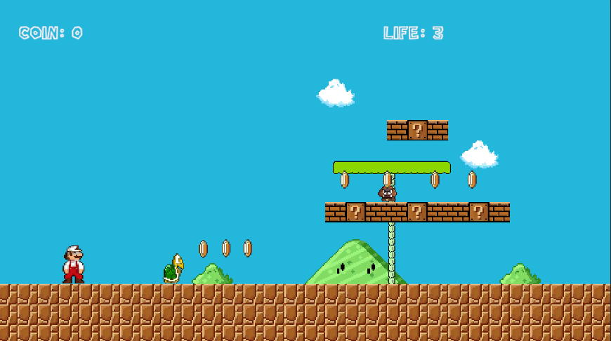
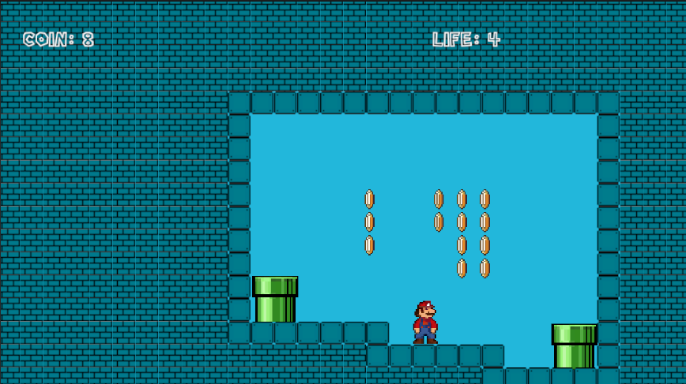
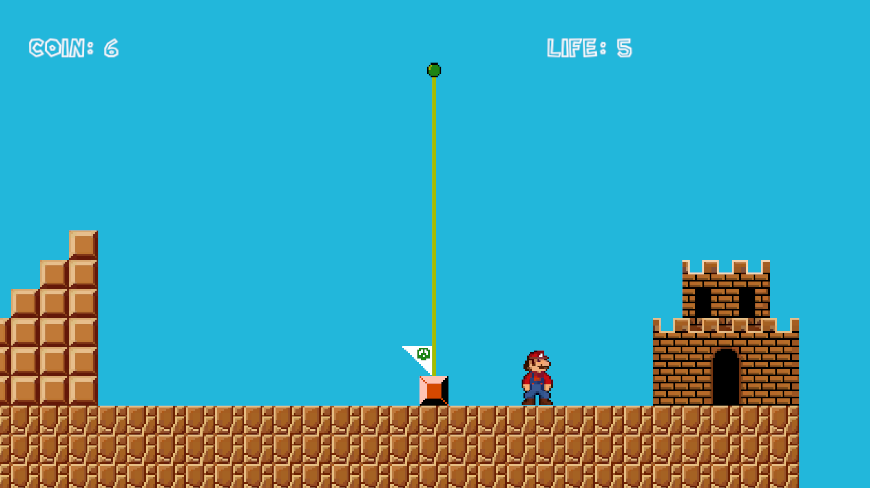

# Mario Bros Gambey Noa

# Version Française

## Description

Ce jeu est un Mario Bros fait dans le cadre du projet de fin de module GameProg encadré par M.Bourdillon Rémi.

## Captures d'écran / Vidéos

## Fonctionnalités principales

1. **[Déplacement]:** Avancer, reculer,sauter.
2. **[Etat de Mario]:** Mario peut être petit, grand ou feu.
    - **[Petit = 1]:** Mario peut sauter et avancer.
    - **[Grand = 2]:** Mario peut sauter, avancer et tuer les ennemis en leur sautant dessus.
    - **[Feu = 3]:** Mario peut sauter, avancer, tuer les ennemis en leur sautant dessus.
3. **[Plante]:**  Un ennemi qui se déplace selon un pattern, qui peut être tué si le joueur lui saute dessus.
    - **[Collision]:** Si le joueur touche la plante, son état prend -1
4. **[Goomba]:** Un ennemi qui se déplace selon un pattern.
    - **[Collision]:** Si le joueur touche le goomba, ison état prend -1
    - **[Mort]:** Si le joueur lui saute dessus, le goomba meurt.
5. **[Koopa]:** Un ennemi qui se déplace selon un pattern.
    - **[Collision]:** Si le joueur touche le koopa,son état prend -1
    - **[Mort]:** Si le joueur lui saute dessus, le koopa meurt et laisse apparaitre une carapace.
6. **[Carapace]:** Un objet qui est statique mais si le joueur le frappe il avance de maniere continue et change de direction au contacte d'un obstacle.
    - **[Collision]:** Si le joueur touche la carapace, il meurt et perd une vie.
    - **[Mort]:** Si le joueur lui saute dessus, la carapace s'arrete (Bug si le joueur est petit ne marche pas).
7. **[Pièce]:** Un objet qui est statique et qui disparait au contacte du joueur et ajoute +1 au score du joueur.
8. **[Vie]:** Si la vie du joueur tombe à 0 fais un GAME OVER sinon un écran de TRY AGAIN. Le joueur en à 3 au début de la partie.
    - **[Vie+1]:** Le joueur peut gagner des vies en collectant 10 pièces.
9. **[Score]:** Un score qui augmente de 1 à chaque pièce collectée.
10. **[Ecran de victoire]:** Un écran qui apparait une fois le joueur touche le drapeau de fin de niveau avec le score et les vies restantes et propose au joueur de recommencer ou quitter.
11. **[Ecran de Game Over]:** Un écran qui apparait une fois la vie du joueur tombe à 0 et propose au joueur de recommencer le niveau ou quitter.
12. **[Ecran de Try Again]:** Un écran qui apparait une fois le joueur meurt.
13. **[Ecran de Pause]:** Un écran qui apparait une fois le joueur appuie sur la touche "Echap" et propose au joueur de reprendre la partie ou quitter.
14. **[Ecran de Menu Principal]:** Un écran qui apparait une fois le joueur lance le jeu et propose au joueur de commencer une partie ou quitter ou d'acceder au parametres.
    - **[Parametres]:** Un écran qui permet de régler le volume du jeu, le plein écran et la résolution de l'écran(basé sur celles possible sur votre écran).
15. **[Block Mystere]:** Un Block qui à un point d'interrogation et qui peut contenir une pièce ou un item.
    - **[Champignon]:** Un objet qui quand il apparait se déplace linéairement et change l'état de Mario si il est petit en Mario Grand.
    - **[Fleur de Feu]:** Un objet qui est statique et change l'état de Mario en mario feu (pas de tire de boule de feu).
16. **[Drapeau]:** Un drapeau qui un fois touché descend et lance l'écran de victoire.
17. **[Caméra]:** Une caméra qui suis le joueur sur la longueur du niveau et non sur la hauteur.
18. **[Tuyau]:** Un objet qui est statique et qui permet de passer d'accéder au souterrain en allant dessus et en appyant sur la touche "S" ou fleche du bas.
19. **[Niveau]:** Un niveau qui est composé de blocs, de pièces, de plantes, de goombas, de koopas, de carapaces, de pièces, de blocs mysteres, de champignons, de fleurs de feu et de drapeaux.
20. **[Paralax]:** Un effet de paralax sur le fond du jeu.
21. **[Musique]:** Une musique de fond qui change en fonction de l'état de Mario.
    - **[Effet sonore]:** Un effet sonore qui se joue quand le joueur saute, tue un ennemi, collecte une pièce, meurt, touche un ennemi, touche une carapace, touche un bloc mystere, touche un champignon, touche une fleur de feu, touche un drapeau, touche un tuyau.

## Comment Jouer

Le Jeu est jouable avec les touches "zqsd" (ou fleches directionnelles) pour se déplacer et "espace" pour sauter.

## Objectifs du jeu
- Ne pas mourir
- Atteindre le drapeau de fin de niveau
- Collecter un maximum de pièces pour avoir un maximum de vie

## Configuration Requise

- **Système d'exploitation:** [Windows 10 ou 11]

## Installation

- Lancé le fichier .exe dans le dossier Game
- Apprécié le jeu

## Crédits

- **Développeur:** [Gambey Noa]
- **Conception du Jeu:** [Gambey Noa]
- **Artiste:** [Internet]
- **Musique et Effets Sonores:** [Koji Kondo]
- **Testeurs Bêta:** [Gendron Adrien]
- **Mention Spéciale:** [Shigeru Miyamoto/Takashi Tezuka]

# English Version

## Description

This game is a Mario Bros made as part of the GameProg end-of-module project supervised by Mr. Bourdillon Rémi.

## Screenshots / Videos

## Main Features

1. **[Movement]:** Move forward, backward, jump.
2. **[Mario's State]:** Mario can be small, big, or fire.
    - **[Small = 1]:** Mario can jump and move forward.
    - **[Big = 2]:** Mario can jump, move forward, and kill enemies by jumping on them.
    - **[Fire = 3]:** Mario can jump, move forward, and kill enemies by jumping on them.
3. **[Plant]:** An enemy that moves according to a pattern, which can be killed if the player jumps on it.
    - **[Collision]:** If the player touches the plant, their state decreases by 1.
4. **[Goomba]:** An enemy that moves according to a pattern.
    - **[Collision]:** If the player touches the goomba, their state decreases by 1.
    - **[Death]:** If the player jumps on it, the goomba dies.
5. **[Koopa]:** An enemy that moves according to a pattern.
    - **[Collision]:** If the player touches the koopa, their state decreases by 1.
    - **[Death]:** If the player jumps on it, the koopa dies and leaves behind a shell.
6. **[Shell]:** An object that is static but moves continuously if the player hits it and changes direction upon hitting an obstacle.
    - **[Collision]:** If the player touches the shell, they die and lose a life.
    - **[Death]:** If the player jumps on it, the shell stops (Bug if the player is small does not work).
7. **[Coin]:** A static object that disappears upon player contact and adds +1 to the player's score.
8. **[Life]:** If the player's life reaches 0, display a GAME OVER screen otherwise a TRY AGAIN screen. The player starts with 3 lives.
    - **[Life+1]:** The player can earn lives by collecting 10 coins.
9. **[Score]:** A score that increases by 1 for each collected coin.
10. **[Victory Screen]:** A screen that appears once the player touches the end level flag with the score and remaining lives and offers the player to retry or quit.
11. **[Game Over Screen]:** A screen that appears once the player's life reaches 0 and offers the player to retry the level or quit.
12. **[Try Again Screen]:** A screen that appears once the player dies.
13. **[Pause Screen]:** A screen that appears once the player presses the "Escape" key and offers the player to resume the game or quit.
14. **[Main Menu Screen]:** A screen that appears once the player launches the game and offers the player to start a game, quit, or access settings.
    - **[Settings]:** A screen that allows adjusting the game volume, fullscreen, and screen resolution (based on those available on your screen).
15. **[Mystery Block]:** A block with a question mark that can contain a coin or an item.
    - **[Mushroom]:** An object that when it appears moves linearly and changes Mario's state if he is small to Big Mario.
    - **[Fire Flower]:** A static object that changes Mario's state to fire Mario (no fireball shooting).
16. **[Flagpole]:** A flagpole that, once touched, descends and launches the victory screen.
17. **[Camera]:** A camera that follows the player horizontally across the level and not vertically.
18. **[Pipe]:** A static object that allows access to the underground by going over it and pressing the "S" key or down arrow.
19. **[Level]:** A level composed of blocks, coins, plants, goombas, koopas, shells, coins, mystery blocks, mushrooms, fire flowers, and flagpoles.
20. **[Parallax]:** A parallax effect on the game's background.
21. **[Music]:** Background music that changes according to Mario's state.
    - **[Sound Effect]:** A sound effect that plays when the player jumps, kills an enemy, collects a coin, dies, touches an enemy, touches a shell, touches a mystery block, touches a mushroom, touches a fire flower, touches a flagpole, touches a pipe.

## How to Play

The game is playable using the "wasd" keys (or arrow keys) to move and "space" to jump.

## Objectives of the Game
- Do not die
- Reach the end level flag
- Collect as many coins as possible to have maximum lives

## System Requirements

- **Operating System:** [Windows 10 or 11]

## Installation

- Launch the .exe file in the folder Game
- Enjoy the game

## Credits

- **Developer:** [Gambey Noa]
- **Game Design:** [Gambey Noa]
- **Artist:** [Internet]
- **Music and Sound Effects:** [Koji Kondo]
- **Beta Testers:** [Gendron Adrien]
- **Special Thanks:** [Shigeru Miyamoto/Takashi Tezuka]

## Contact
noa.gambey@ynov.com
